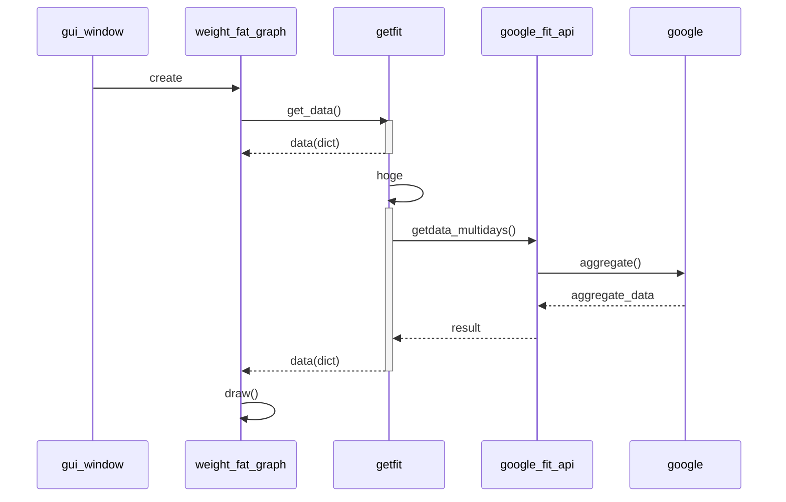

```mermaid
sequenceDiagram
    gui_window ->> weight_fat_graph:create
    
    weight_fat_graph ->> getfit:get_data()
    activate getfit
    getfit -->> weight_fat_graph:data(dict)
    deactivate getfit
    getfit ->>+ getfit:hoge
    getfit ->> google_fit_api:getdata_multidays()
    google_fit_api ->> google:aggregate()
    google -->> google_fit_api :aggregate_data
    google_fit_api -->> getfit : result
    getfit -->>- weight_fat_graph : data(dict)
    
    weight_fat_graph ->> weight_fat_graph : draw()
```